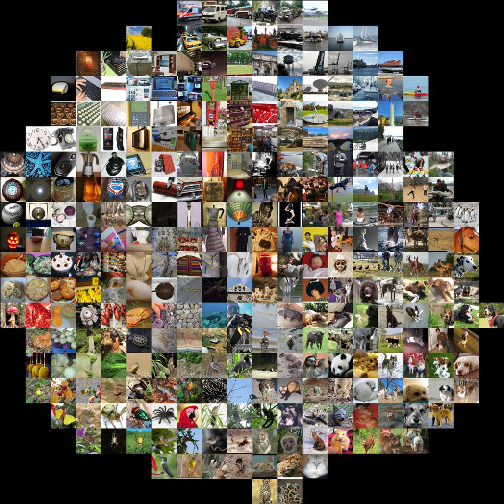
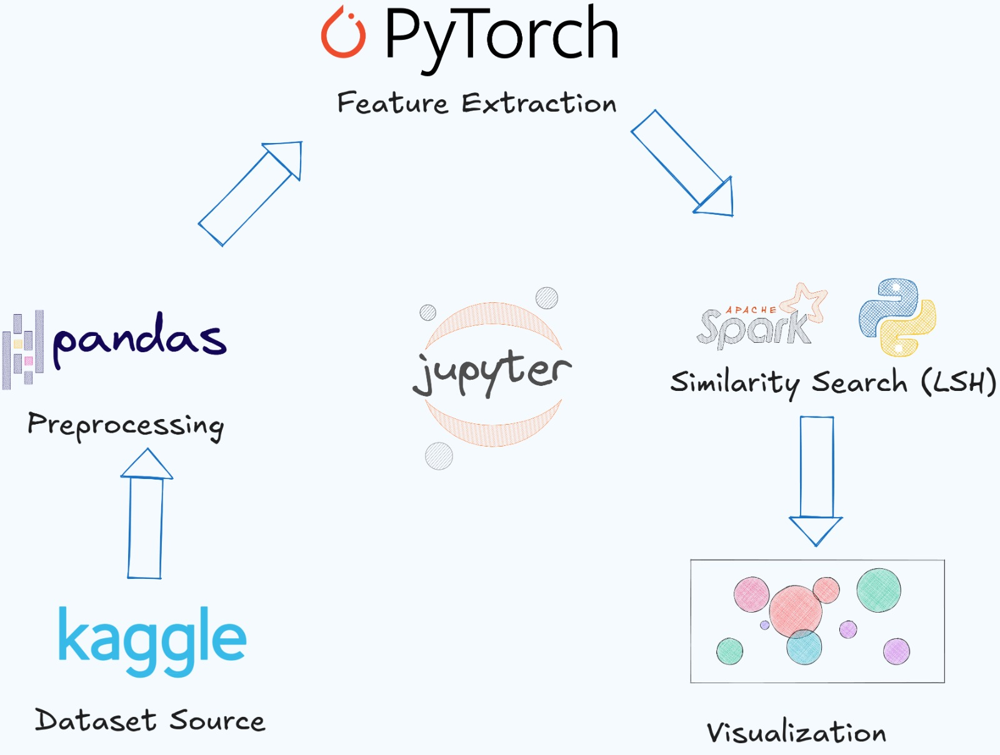

# Vehicle Image Similarity Search using Deep Learning and PySpark

### Overview

This project focuses on finding similar vehicle images using deep learning and PySpark. It involves extracting image embeddings using a pre-trained ResNet-18 model, storing these embeddings, and performing a similarity search using Locality-Sensitive Hashing (LSH) in PySpark. The goal is to identify the most similar vehicles based on their image features.


<div align="center">
    
</div>

**Data Source**: The project uses the [Stanford Cars Dataset](https://www.kaggle.com/datasets/jessicali9530/stanford-cars-dataset), which contains images of cars from different classes..


## Table of Contents
- [Project Features](#project-features)
- [Project Architecture](#project-architecture)
- [Technologies Used](#technologies-used)
- [Running the Application](#running-the-application)
- [Project Structure](#project-structure)
- [Contact](#contact)

## Project Features

- **Image Embedding Extraction**: Uses a pre-trained ResNet-18 model to extract feature vectors (embeddings) from vehicle images.
- **Locality-Sensitive Hashing (LSH)**: Implements LSH in PySpark to efficiently find similar images based on their embeddings.
- **Scalable Similarity Searchr**: Handles large datasets by leveraging PySpark's distributed computing capabilities.
- **Show Results**: Displays the most similar images for a given query image.


## Project Architecture

Below is the high-level architecture of the project, including image acquisition, preprocessing, digit recognition, solution, and visualization stages.



1. **Image Preprocessing**: Resizes and normalizes images to prepare them for feature extraction.
2. **Feature Extraction:**: Uses a pre-trained ResNet-18 model to extract 512-dimensional feature vectors from the images.
3. **LSH Indexing**: Applies Locality-Sensitive Hashing (LSH) to index the feature vectors for efficient similarity search.
4. **Similarity Search**: Queries the LSH index to find the most similar images for a given input image.
5. **Results Visualization**: Displays the query image and its nearest neighbors.


## Technologies Used

- **Python**: Core programming language.
- **PyTorch**: For loading and using the pre-trained ResNet-18 model.
- **PySpark**: For distributed computing and implementing LSH.
- **Pillow/Pandas**: For image handling and manipulation and storage.

## Running the Application

1. **Clone the Repository**:
   - First, clone the repository to your local machine:
     ```bash
     git clone https://github.com/Carlos93U/Vec2Car.git
     cd Vec2Car
     ```
2. **Create and Activate Virtual Environment**:
   - It is recommended to create a virtual environment to manage the dependencies:
     ```bash
     python -m venv env
     source env/bin/activate  # Linux/Mac
     .\env\Scripts\activate  # Windows
     ```

3. **Run first cell on notebook to install dependencies**:
   - Install the required dependencies running first cell on notebook:
     ```bash
     !pip install pandas
     !pip install pyspark
     !pip3 install torch torchvision --index-url https://download.pytorch.org/whl/cpu
     !pip3 install tqdm
     ```
4. **Run all cells on notebook**:
   - Run all cells on notebook to extract embeddings and perform similarity search:

## Project Structure

The following is an overview of the main folders and files within the project.

```plaintext
Vec2Car/
├── data/                      # Data files and images
│   ├── car_dataset_test.csv
│   ├── car_dataset_train.csv
│   ├── input_data_vectors.csv
│   ├── cars_test/
│   ├── cars_train/
│   └── input_images_cnn/
│
├── notebooks/                  # Notebook for data preprocessing and model training
├── docs/                       # Project documentation
└── README.md                   # Project documentation

```

## Contact

For any questions or feedback, please contact:

**Juan C. Huillcas**  
Email: [huillcas.juan3@gmail.com](mailto:huillcas.juan3@gmail.com)  
LinkedIn: [Juan C. Huillcas](https://www.linkedin.com/in/juan-carlos-huillcas)  

---
